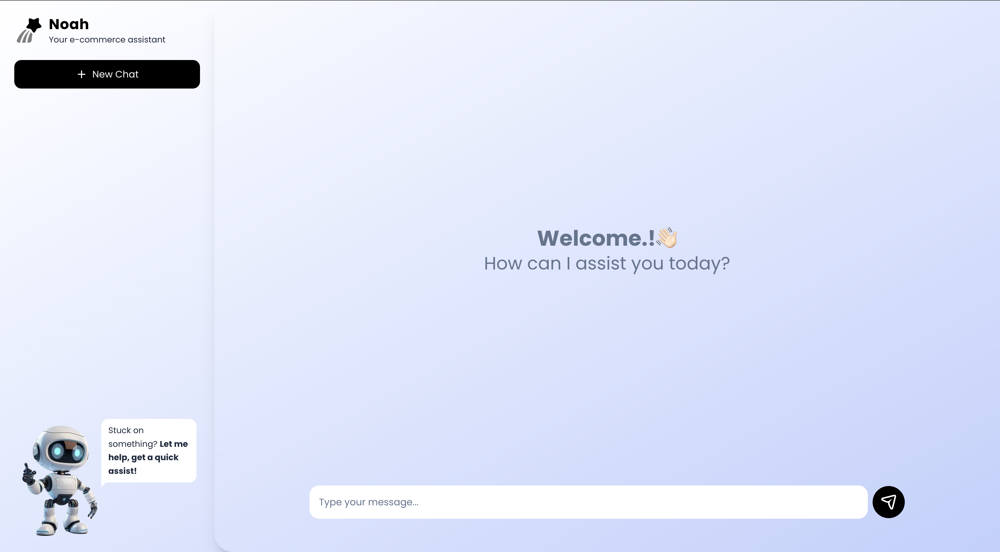

# Noah - E-Commerce Live Chat Agent 🤖

An AI-powered customer support chatbot for e-commerce stores, built with Next.js and Express.



## Features

- 💬 Real-time chat interface with AI-powered responses
- 🛒 Specialized for e-commerce customer support (shipping, returns, store policies)
- 💾 Persistent chat sessions across page reloads
- 🎨 Modern, responsive UI with Tailwind CSS
- 🔄 Conversation history stored in SQLite database

## Tech Stack

### Frontend
- **Next.js 16** - React framework
- **React 19** - UI library
- **Tailwind CSS 4** - Styling
- **TypeScript** - Type safety

### Backend
- **Express 5** - Node.js web framework
- **Better-SQLite3** - SQLite database
- **Google Generative AI (Gemini)** - AI responses
- **TypeScript** - Type safety

## Prerequisites

- **Node.js** v20.6+ (required for `--env-file` flag)
- **npm** or **yarn**
- **Google Gemini API Key** - Get one from [Google AI Studio](https://aistudio.google.com/app/apikey)

## Project Structure

```
live-chat-agent/
├── app/                    # Next.js frontend
│   ├── page.tsx           # Main chat interface
│   ├── layout.tsx         # Root layout
│   └── globals.css        # Global styles
├── backend/               # Express backend
│   └── src/
│       ├── index.ts       # Server entry point
│       ├── routes/
│       │   └── chat.ts    # Chat API routes
│       ├── services/
│       │   ├── chat_service.ts  # Chat logic
│       │   └── llm_service.ts   # AI integration
│       └── db/
│           ├── db.ts      # Database connection
│           ├── messages.ts # Message queries
│           └── schema.sql # Database schema
├── public/                # Static assets
└── README.md
```

## Getting Started

### 1. Clone the Repository

```bash
git clone <repository-url>
cd live-chat-agent
```

### 2. Setup Backend

```bash
# Navigate to backend directory
cd backend

# Install dependencies
npm install

# Create environment file
cp .env.example .env
# Or create manually:
echo "GEMINI_API_KEY=your_api_key_here" > .env
echo "DATABASE_URL=file:./src/db/app.db" >> .env

# Start the backend server
npm run dev
```

The backend will run on `http://localhost:4000`

### 3. Setup Frontend

```bash
# Navigate back to root directory (from backend)
cd ..

# Install dependencies
npm install

# Start the frontend development server
npm run dev
```

The frontend will run on `http://localhost:3000`

### 4. Open the App

Visit [http://localhost:3000](http://localhost:3000) in your browser to start chatting with Noah!

## Environment Variables

### Backend (`backend/.env`)

| Variable | Description | Required |
|----------|-------------|----------|
| `GEMINI_API_KEY` | Your Google Gemini API key | Yes |
| `PORT` | Server port (default: 4000) | No |

## API Endpoints

| Method | Endpoint | Description |
|--------|----------|-------------|
| `POST` | `/chat/message` | Send a message and get AI response |
| `GET` | `/chat/history/:sessionId` | Get conversation history |

### POST /chat/message

**Request Body:**
```json
{
  "message": "What is your return policy?",
  "sessionId": "optional-session-id"
}
```

**Response:**
```json
{
  "reply": "Items can be returned within 30 days for a full refund...",
  "sessionId": "uuid-session-id"
}
```

## Development

### Running Both Servers

You'll need two terminal windows:

**Terminal 1 - Backend:**
```bash
cd backend
npm run dev
```

**Terminal 2 - Frontend:**
```bash
npm run dev
```

### Resetting the Database

To clear all chat history:
```bash
rm backend/src/db/app.db
```
The database will be recreated automatically when the backend restarts.

## Scripts

### Frontend
- `npm run dev` - Start development server
- `npm run build` - Build for production
- `npm run start` - Start production server
- `npm run lint` - Run ESLint

### Backend
- `npm run dev` - Start development server with hot reload
- `npm run build` - Compile TypeScript
- `npm run start` - Start production server

## License

ISC
